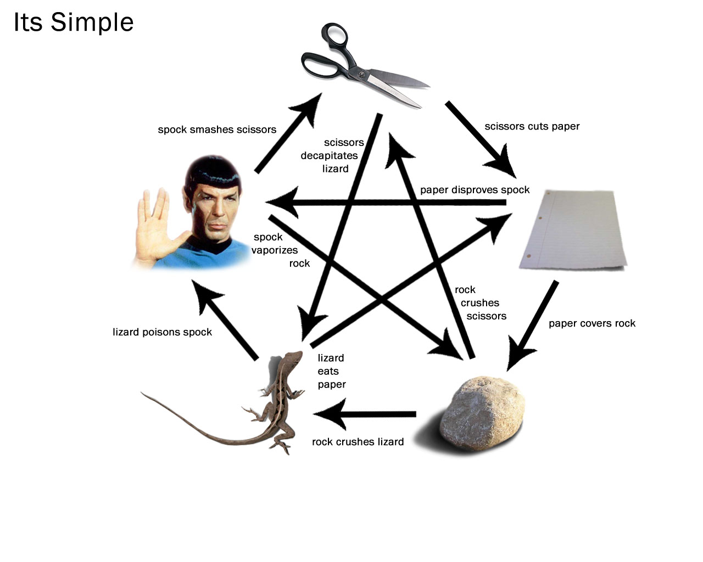

# Rock, Paper, Scissor, Lizard, Spock Game Kata

RPSLS To increase the odds of the old fashioned game (Rock, Paper, Scissors) Sheldon and Raj increase the odds to have 5 different items instead of 3. Hence forth Rock, Paper, Scissor, Lizard, Spock.

To test the result of the game write a Kata!

Examples: 
```
rpslp "rock" "spock" -- should return "Player 2 won!"
rpslp "scissor" "lizard" -- should return "Player 1 won!"
rpslp "scissor" "Scissor" -- should return "Draw!"
rpslp "foo" "Bar" -- should return "Oh, Unknown Thing"
```


[Original Kata from Code wars](https://www.codewars.com/kata/569651a2d6a620b72e000059)
